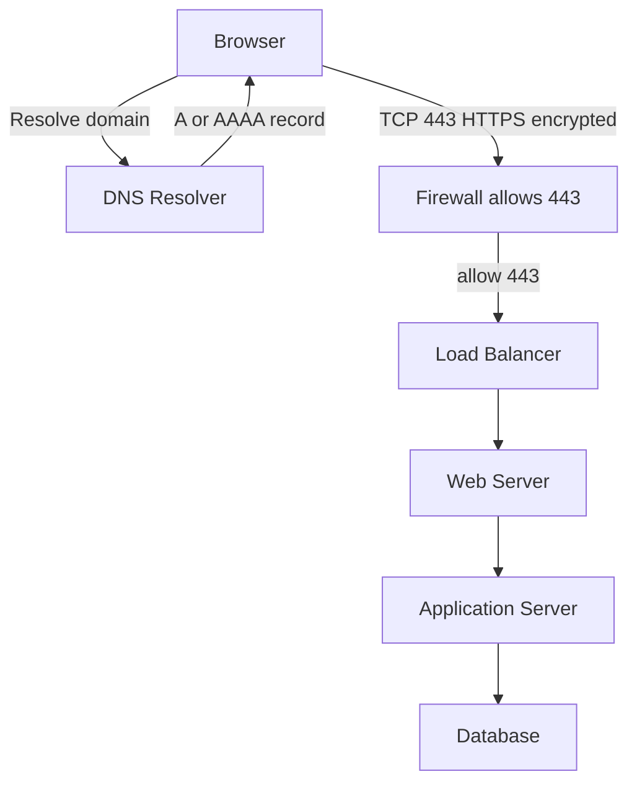

# Diagram

```mermaid
flowchart TD
  Browser[Browser] -->|Resolve domain| DNSR[DNS Resolver]
  DNSR -->|A or AAAA record| Browser
  Browser -->|TCP 443 HTTPS encrypted| FW[Firewall allows 443]
  FW -->|allow 443| LB[Load Balancer]
  LB --> WS[Web Server]
  WS --> APP[Application Server]
  APP --> DB[Database]

```
